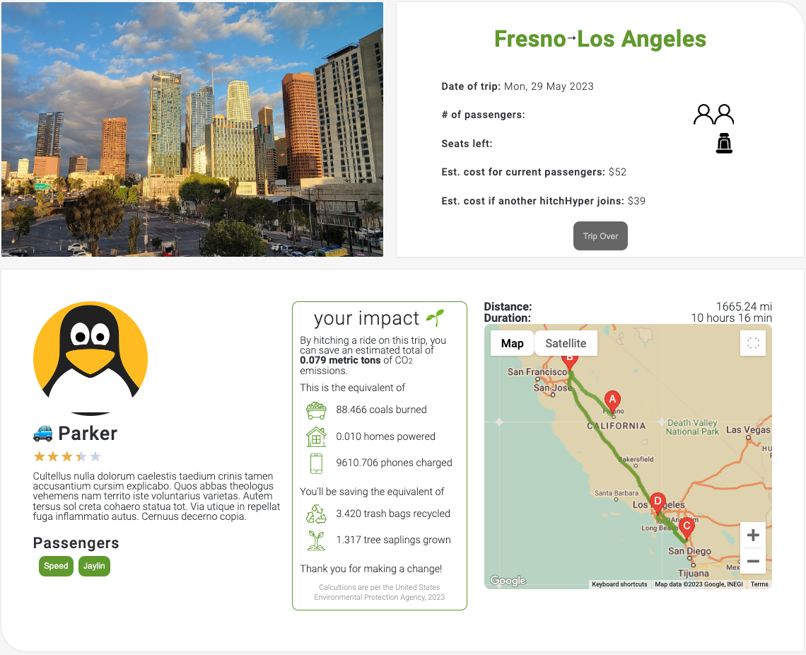

# hitchHype
hitchHype is a platform connecting drivers and riders for long-distance carpooling with an emphasis on saving on gas money and reducing carbon emissions.


## Background and Overview
With rising gas prices and the ever-increasing concern of climate change, going on road trips can be a financially and ethically-motivated decision. hitchHype allows users to alleviate their worries by pairing potential drivers and passengers to create a more fun and eco-friendly alternative to driving alone, while keeping more money in their pockets.

Drivers can create a trip listing, welcoming potential passengers to hitch a ride. It's as simple as
1. Picking a date for their trip
2. Deciding how many riders they want to accomodate, and
3. Entering a start location and destination location

People looking for a ride can browse these listings to join trips, where they can request dropoff points along the way. They can view a variety of trips and filter based on start location, destination, and trip date. Simply select a trip, and press a button to join a ride.

Drivers can then decide whether to keep the hitchHyper, and contact them through their listed phone number.

## Technologies
* MongoDB - NoSQL backend database
* Express - backend Node.js web application framework
* React - JavaScript library for frontend components
* Node.js - backend JavaScript runtime environment
* Google Map and Places API - generates map, routes, and destination pictures

## Key Features

### User Log in and Sign up
Users can Sign up to create a new account or log in to a pre-existing account with our popup modal and password encryption


### Create a trip
Users who are logged in and have a car saved in their profile can naviate over to the 'Create a Trip' page to create a trip using our interactive google maps


### Join a trip
Users can join a trip by navigating to the trips show page and clicking 'request ride'. A popup modal will then propt the user to input their dropoff location and update the new route to display start, end and new dropoff locations


### Carbon Emissions
Potential reduction in carbon emissions are featured on the trip pages, showing the impact a driver or rider would have in reducing carbon emissions by taking that trip with fellow hitchHypers.


hitchHype calculates carbon emissions and their equivalencies based on the following
* an average 25.4 mpg fuel economy<sup>1</sup>
* total distance of the trip
* greenhouse equivalencies calculations<sup>2</sup>

<sub>1 [The 2022 EPA Automotive Trends Report](https://www.epa.gov/automotive-trends)</sub>

<sub>2 [U.S. Environmental Protection Agency Greenhouse Gases Equivalencies](https://www.epa.gov/energy/greenhouse-gases-equivalencies-calculator-calculations-and-references)</sub>


```
//metric tons CO2 per gallon of gasoline consumed
const gasolineEmissions = (gallons) => {
    const metricTonsCO2 = gallons * (8.887 * Math.pow(10, -3));
    return metricTonsCO2;
}
```

### Trips Index & Search Bar
Users can view and search through all trips regardless of being logged in. On the index page all trips will appear. Once a user has entered inputs to the search bar trips will be filtered based on the input fields.
readme-images/TripSearch.mov

### Trip Show Page (Rider Viewpoint)
All users can view trip show pages by clicking on a trip from the Trips index page. Trip information, such as: origin, destination, passenger seats available, likely price to join trip as passenger, and your environmental impact by joining the ride is available to all users despite not being logged in. Once a user is logged in a request ride button will appear prompting our request a ride modal. If a user is a passenger a button to leave trip will appear.
Additionally, upon completion of a trip, passengers will also be able to leave a review for their driver.


### Trip Show Page (Driver Viewpoint)
Once logged in and inside of a trip they have created, the drivers' side of the trip show page has additional information about their passengers and contact information. Once the date of a trip has passed, drivers can leave reviews for their passengers.


### Trip Update Page (Driver Viewpoint)
Drivers can decide to update the amount of passengers they would like to drive or decline to pick up a passenger by removing them from the trip.


## Future Updates
### Ride Request and Chat
* Drivers will have the ability to approve or deny a ride request before adding a passenger to the trip
* Potential passengers will have to send a message to request ride

### Real-Time Chat
* Real-time messaging between the driver and passengers to coordinate rides over the app for a secure conversation without revealing personal phone numbers

### Profile Pictures
* Implement CRUD feature for user profile images
* Implement AWS S3 cloud storage to store profile pictures

## Team
* Queen Belle Dela Cruz, project lead, fullstack
* Raymond Tan, backend lead
* Brittiny Filbert, frontend-focused
* Krikor Andonian, frontend-focused, Google Maps API